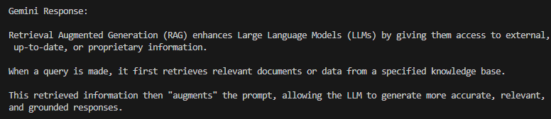

# RAG Knowledge System

> **An AI-powered system that answers questions using your own documents — powered by Gemini 2.5 Flash & LangChain**


---

## What is this?

This project builds a **Retrieval-Augmented Generation (RAG)** pipeline that lets you upload your own documents and ask questions about them. Instead of relying on general AI knowledge, it retrieves exact information from *your* files and generates precise answers.

```
Document → Loader → Chunks → Embeddings → Vector DB → Query → Retrieve → LLM → Answer
            (LangChain)        (FAISS)                          (Gemini 2.5 Flash)
```

---

## Two Pipelines Inside Every RAG System

### A. Ingestion Pipeline *(Offline — runs once)*

```
Documents
   ↓
Load Documents       ← LangChain Document Loaders
   ↓
Chunk Documents      ← RecursiveCharacterTextSplitter
   ↓
Generate Embeddings  ← Google Generative AI Embeddings
   ↓
Store in Vector DB   ← FAISS
```

### B. Query Pipeline *(Runtime — runs on every question)*

```
User Query
   ↓
Query Embedding         ← Same embedding model
   ↓
Vector Similarity Search ← FAISS retriever
   ↓
Top Relevant Chunks     ← Top-k results
   ↓
Inject Context into Prompt
   ↓
Gemini 2.5 Flash        ← LLM generates answer
   ↓
Final Answer 
```

---

## Tech Stack

| Component | Technology |
|-----------|-----------|
| LLM | Gemini 2.5 Flash |
| Framework | LangChain |
| Vector Store | FAISS |
| Embeddings | gemini-embedding-001 |
| Language | Python 3.11.9 |
| Document Loaders | PyPDF, TextLoader |

> I used FAISS for this project as "Just pip install" "Works Offline" and most importantly "Free Forever".

---

## Project Structure

```
rag-knowledge-system/
│
├── app/
│   ├── main.py           # Entry point & Gemini API test
│   ├── ingest.py         # Document loading , chunking & FAISS storage
│   ├── query.py          # User query interface
│   └── rag_pipeline.py   # Full RAG pipeline
│
├── data/
│   └── documents/        # 📂 Place your documents here
│
├── vectorstore/          # Auto-generated FAISS index
│   ├── index.faiss
│   └── index.pkl
│
├── .env                  # API keys (never commit this!)
├── requirements.txt
└── README.md
```

---

##  Quick Start

### 1. Create virtual environment
```bash
py -3.11 -m venv venv
venv\Scripts\activate      # Windows
```

### 2. Install dependencies
```bash
pip install -r requirements.txt
```

### 3. Set up API key
Create a `.env` file:
```
GOOGLE_API_KEY=your_gemini_api_key_here
```
Get your free API key at: https://aistudio.google.com/apikey

## Security Note

> ⚠️ **Never commit your `.env` file!** It contains your API key. The `.gitignore` already excludes it.

### 4. Demo Output


### 5. Ingestion Pipeline
Load -> Split/Chunk -> Embed -> Store
```
vectorstore/
├── index.faiss    ← actual vector data (embeddings)
└── index.pkl      ← metadata & original chunk text
```
