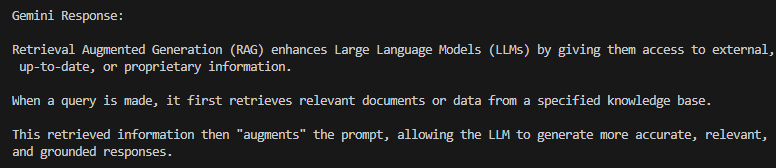

# RAG Knowledge System

> Ask questions from your own documents. Get precise answers. No hallucinations.


**Live Demo →** [rag-knowledge-system.streamlit.app](https://rag-knowledge-system-4rxjfjre8e3dg9yqjqpubl.streamlit.app)

---

## What it does

Upload any document. Ask anything about it. The system retrieves only the relevant parts and generates a grounded answer - no guessing, no hallucinations.

Supports **PDF · TXT · PPTX · DOCX · JPG · PNG** out of the box.

---

## How it works

Two pipelines run under the hood:

**Ingestion** *(runs once per document)*
```
Documents
   ↓
Load Documents       ← LangChain Document Loaders
   ↓
Chunk Documents      ← RecursiveCharacterTextSplitter
   ↓
Generate Embeddings  ← Google Generative AI Embeddings
   ↓
Store in Vector DB   ← FAISS
```

**Query** *(runs on every question)*
```
Query
   ↓
Query Embedding         ← Same embedding model
   ↓
Vector Similarity Search ← FAISS retriever
   ↓
Top Relevant Chunks     ← Top-k results
   ↓
Inject Context into Prompt
   ↓
Gemini 2.5 Flash        ← LLM generates answer
   ↓
Final Answer 
```

Images are processed via Gemini Vision. Everything else is handled locally — no cloud database, no extra cost.

---

## Tech Stack

| Layer | Tool | Why |
|-------|------|-----|
| LLM | Gemini 2.5 Flash | Best free-tier model in 2025 |
| Embeddings | gemini-embedding-001 | Same API, zero extra setup |
| Retrieval | FAISS | Local, offline, free forever |
| Orchestration | LangChain Classic | Clean chain abstraction |
| UI | Streamlit | Fast to ship, easy to deploy |
| Language | Python 3.11.9 | Stable for all ML packages |

---

## Project Structure

```
rag-knowledge-system/
├── app/
│   ├── main.py             # API connection test
│   ├── ingest.py           # Document ingestion pipeline
│   ├── rag_pipeline.py     # Core RAG logic
│   ├── query.py            # Terminal interface
│   └── streamlit_app.py    # Web UI
├── .streamlit/
│   └── config.toml         # Theme configuration
├── data/documents/         # Drop files here (local use)
├── assets/
│   └── Demo.png
├── .env                    # API key (never commit)
├── requirements.txt
└── README.md
```

---

## Run Locally

```bash
git clone https://github.com/Swaraj-Mandre/RAG-KNOWLEDGE-SYSTEM.git
cd RAG-KNOWLEDGE-SYSTEM

py -3.11 -m venv venv
venv\Scripts\activate
pip install -r requirements.txt
```

Add your API key (free at [aistudio.google.com/apikey](https://aistudio.google.com/apikey)):
```
# .env
GOOGLE_API_KEY=your_key_here
```

Run the web app:
```bash
streamlit run app/streamlit_app.py
```

Or use the terminal interface:
```bash
python app/ingest.py   # run once per document set
python app/query.py    # start asking questions
```

---

## Free Tier Usage

| Resource | Free Limit |
|----------|-----------|
| Questions/day | 500 |
| Embeddings/day | 1,000 |
| Vector storage | Unlimited (local) |
| Infrastructure cost | ₹0 |

Ingestion is a one-time cost. After that, only questions consume quota.

---

## Demo



